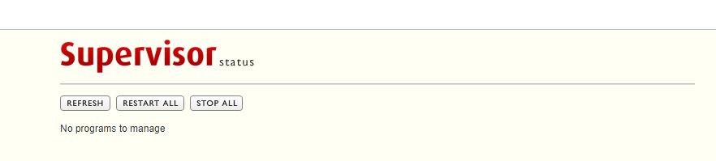

# Install-Hi-Performance-LEMP-on-Centos-7
Install Hi Performance LEMP (Linux+NGINX+MySQL+PHP) [ php v7.4 ]

With 5$ VPS you can serve Million of request
it can prevent any Ddos Attack or any attack.

```yum install -y wget && wget -O install.sh https://raw.githubusercontent.com/abdsmd/Hi-Performance-LEMP-on-Centos-7/main/install.sh && sh install.sh```


Supervisor-Web




> php 7.4

 
> nginx
 
> mysql 5.7
 
> lets encrypt


> redis


> memcached


> supervisor


> make swap if RAM is low


> cron job


> phantomjs


> composer 2.0


> iptables/ firewall


> server time


> system parameter for high performance


> anti ddos


> anti attack


> system limit


> ssh


